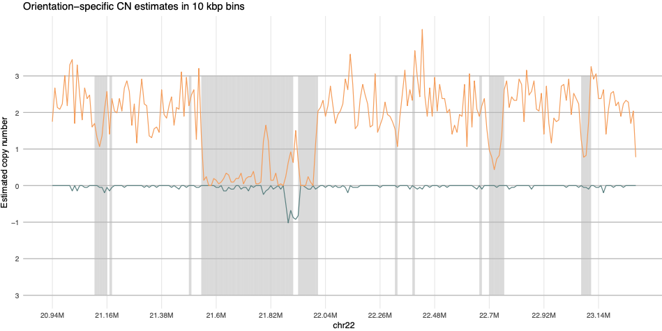

# sseq_plot

Snakemake tool to make a depth plot of Strand-Seq data using the principles of composite files.

# Installation

sseq_plot was developed with the following dependencies:

    snakemake=7.32.4
    R=4.2.0
    ggplot2=3.3.6
    dplyr=1.0.10
    tidyr=1.2.1
    readr=2.1.2
    breakpointR=1.17.1

    python=3.10.11
    sys=3.10.11
    gzip=3.8
    os
# Usage

sseq_plot is implemented as a Snakemake workflow.

1) Edit config/config.yaml:
   1)  to point to your directory of mapped bam files
   2) Congig: Set the desired binsize (recommended: 10kbp)
   3) Link to a 'mappability' file which is part of ArbiGent.
2) run: 

    Snakemake --cores 1

# Output

Output plots can be found in res/[samplename]/pipe_plots/ and may look e.g. as follows, with orange and blue indicating the esimated copy numbers of forward and backward-facing seuqnece content. Regions with low mapping quality are shaded with grey background. 

